# 🌍 CO₂ Emission Forecasting — Vehicle Emissions Predictor

> **Predicting tailpipe CO₂ emissions (g/km) for passenger vehicles using ElasticNet regression with a Streamlit deployment.**


---

## 📌 Table of Contents

- [Project Overview](#-project-overview)
- [Dataset](#-dataset)
- [Project Structure](#-project-structure)
- [Exploratory Data Analysis](#-exploratory-data-analysis)
- [Feature Engineering](#-feature-engineering)
- [Model Training & Performance](#-model-training--performance)
- [Model Diagnostics](#-model-diagnostics)
- [Key Insights](#-key-insights)
- [Streamlit App](#-streamlit-app)
- [How to Run](#-how-to-run)
- [Tech Stack](#-tech-stack)

---

## 🧭 Project Overview

This project builds an end-to-end machine learning pipeline to **predict CO₂ tailpipe emissions (g/km)** for model year 2000 Canadian passenger vehicles. It covers:

- Thorough Exploratory Data Analysis (EDA) of vehicle specifications and emission patterns
- Domain-aware feature engineering using mean target encoding on categorical columns
- ElasticNet regression with hyperparameter tuning via 5-fold cross-validated GridSearchCV
- Full model diagnostics (residual analysis, normality, homoscedasticity)
- A production-ready **Streamlit dashboard** for real-time emission prediction

---

## 📦 Dataset

| Attribute            | Detail                                               |
|----------------------|------------------------------------------------------|
| **Source**           | Canadian fuel consumption ratings — model year 2000  |
| **Records**          | 639 vehicle configurations                           |
| **Manufacturers**    | 36 (CHEVROLET leads with 63 records)                 |
| **Unique Models**    | 328                                                  |
| **Missing Values**   | None                                                 |
| **Target Variable**  | `COEMISSIONS` — CO₂ in g/km (range: 104–582)         |

### Features

| Feature            | Type        | Description                              |
|--------------------|-------------|------------------------------------------|
| `ENGINE SIZE`      | Continuous  | Displacement in litres (1.0 – 8.0 L)    |
| `CYLINDERS`        | Discrete    | Number of cylinders (3–12)              |
| `TRANSMISSION`     | Categorical | Type + gear count (A3, A4, M5, AS5 …)  |
| `FUEL`             | Categorical | Fuel type: X, Z, D, E, N               |
| `FUEL CONSUMPTION` | Continuous  | Combined L/100 km (4.9 – 30.2)          |
| `MAKE`             | Categorical | Manufacturer (36 unique)                |
| `MODEL`            | Categorical | Vehicle model (328 unique)              |

---

## 📁 Project Structure

```
co2-emission-forecasting/
│
├── app/
│   ├── app.py                    # Streamlit frontend
│   ├── backend.py                # Prediction logic
│   ├── app_config.yaml           # App configuration
│   └── images/
│       └── car.jpg
│
├── artifacts/
│   └── model.pkl                 # Serialized trained pipeline
│
├── config/
│   ├── column_config/            # Target encoding maps per feature
│   │   ├── car_make_config.yaml
│   │   ├── car_model_config.yaml
│   │   ├── fuel_config.yaml
│   │   ├── transmission_config.yaml
│   │   └── global_mean.yaml
│   └── model_config/
│       └── artifact_config.yaml  # Best hyperparameters
│
├── data/
│   ├── raw/
│   │   ├── Fuel_consumption.xlsx
│   │   └── README.md
│   └── cleaned/
│       └── df_cleaned.xlsx
│
├── Notebooks/
│   ├── 01_EDA.ipynb
│   ├── 02_Feature_engineering_and_model_training.ipynb
│   ├── 03_model_intuition.ipynb
│   └── reports/                  # All visualizations (PNG)
│
├── requirements.txt
└── README.md
```

---

## 📊 Exploratory Data Analysis

### Numerical Feature Distributions

Engine size, cylinders, and fuel consumption all show **right-skewed distributions**, indicating that most vehicles cluster around smaller, more efficient configurations while a minority of high-performance vehicles pull the tail upward.

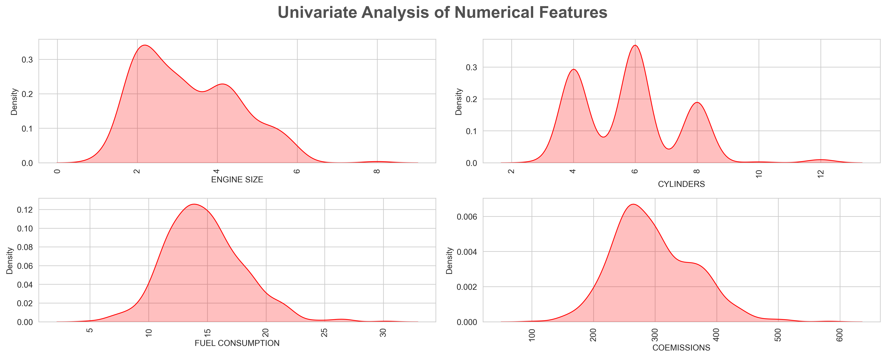

---

### Pairplot — Feature Correlations

The pairplot reveals a **near-perfect linear relationship** between `FUEL CONSUMPTION` and `COEMISSIONS`, making it the single strongest predictor. `ENGINE SIZE` and `CYLINDERS` also show strong positive correlations with the target.

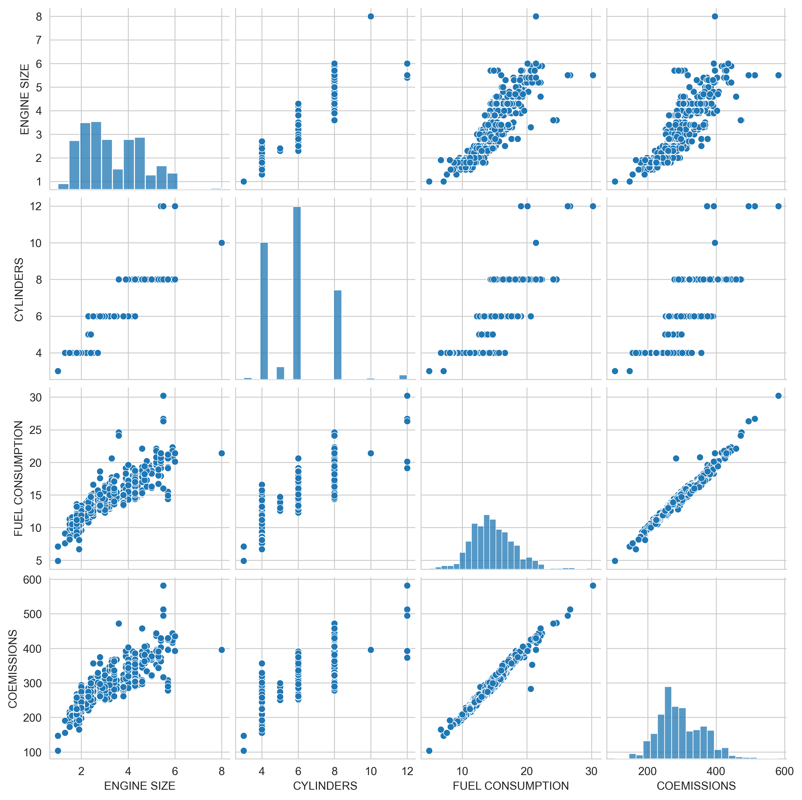

---

### Engine Size vs CO₂

Larger engine displacement consistently produces higher emissions. Vehicles above 5L displacement all breach 400 g/km.


---

### Cylinders vs CO₂

CO₂ output scales almost monotonically with cylinder count — 12-cylinder vehicles emit roughly 3× that of 3-cylinder vehicles.

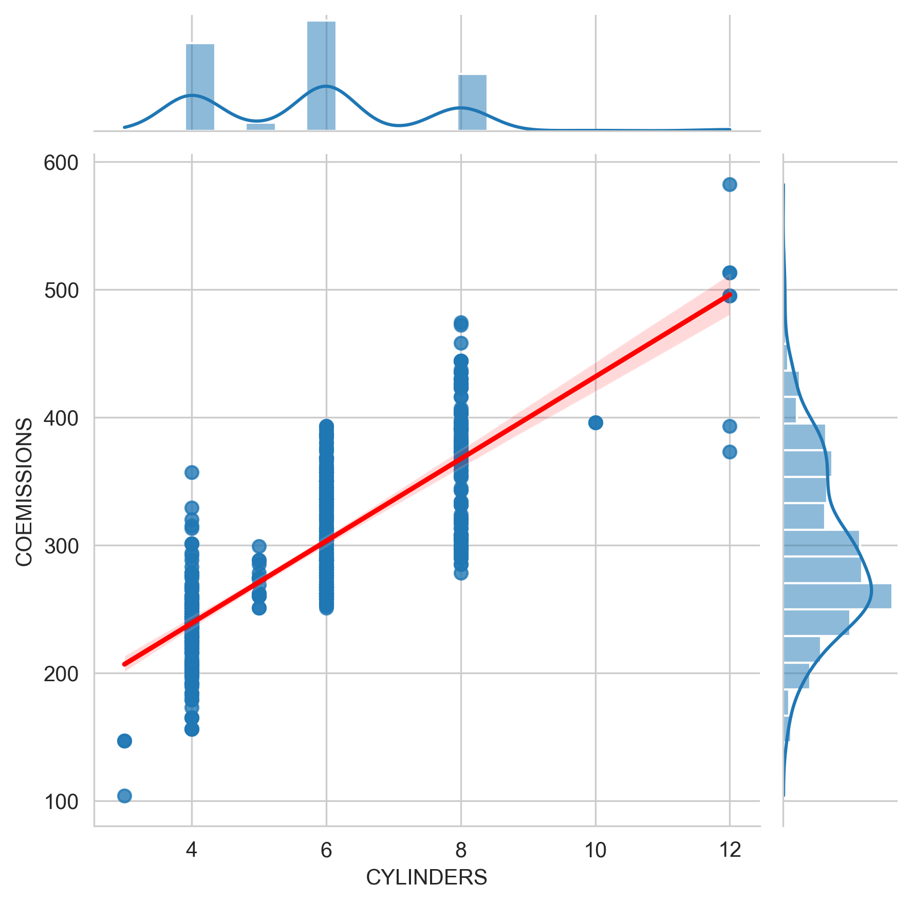

---

### Fuel Consumption vs CO₂

This is the dominant feature. The near-linear relationship (confirmed by OLS R² = 0.998) suggests that fuel consumption alone accounts for nearly all variance in CO₂ output.


---

### CO₂ Distribution by Fuel Type

Diesel (`D`) and Ethanol (`E`) vehicles show markedly different emission profiles compared to standard gasoline (`X`, `Z`). Diesel vehicles exhibit moderate emissions despite higher fuel efficiency; Ethanol vehicles show higher raw consumption but the emissions metric captures only the fossil component.

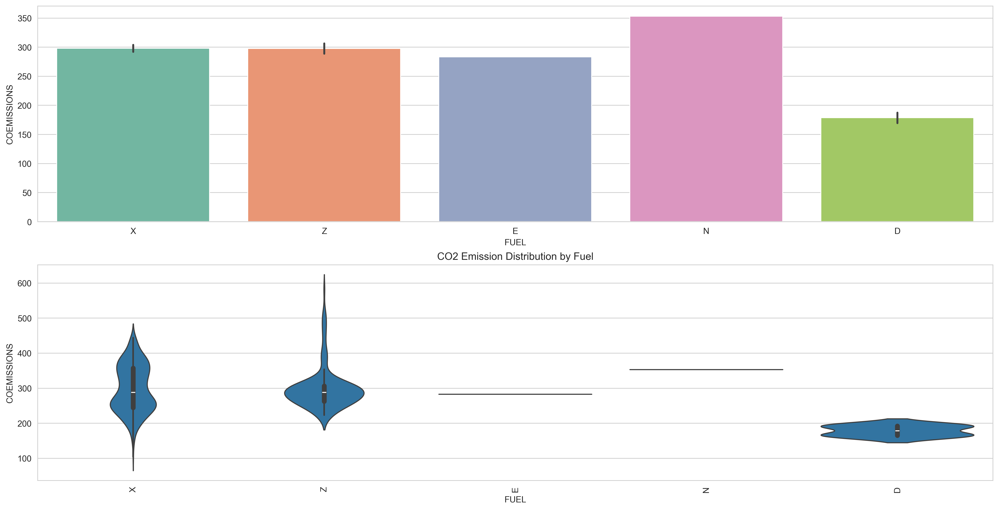

---

### CO₂ Distribution by Manufacturer (Make)

Luxury and performance brands (Ferrari, Lamborghini, Bentley) cluster at the top of the emission range. Economy brands (Honda, Toyota, Hyundai) concentrate in the 200–250 g/km band.

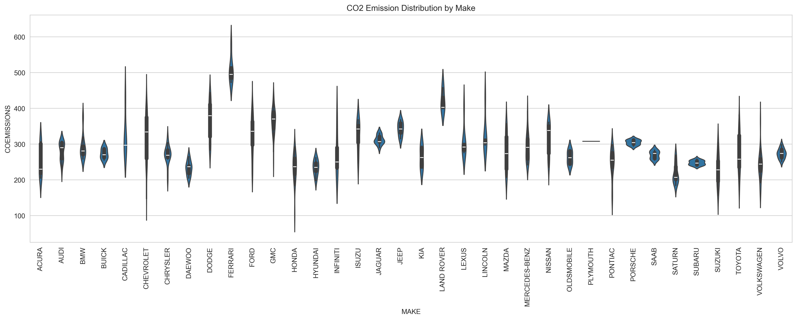

---

### Transmission Type vs CO₂

Manual transmissions (`M5`, `M6`) are associated with lower average emissions than automatic counterparts. `AS` (automatic with select-shift) transmissions occupy a middle band.

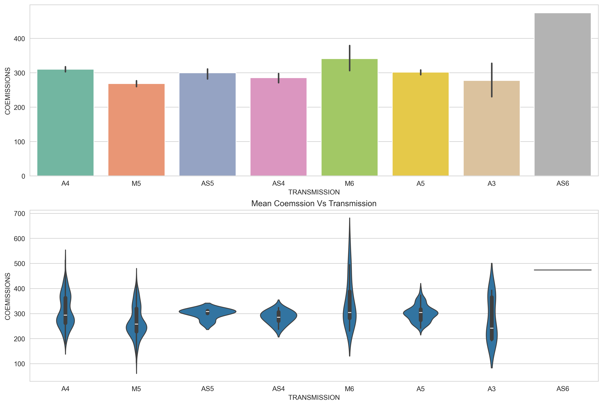

---

### Transmission × Fuel × CO₂ Interaction

The three-way interaction plot reveals that automatic transmissions combined with premium gasoline (`Z`) and diesel (`D`) are associated with the highest emission clusters, while manual + regular gasoline vehicles have the lowest footprint.

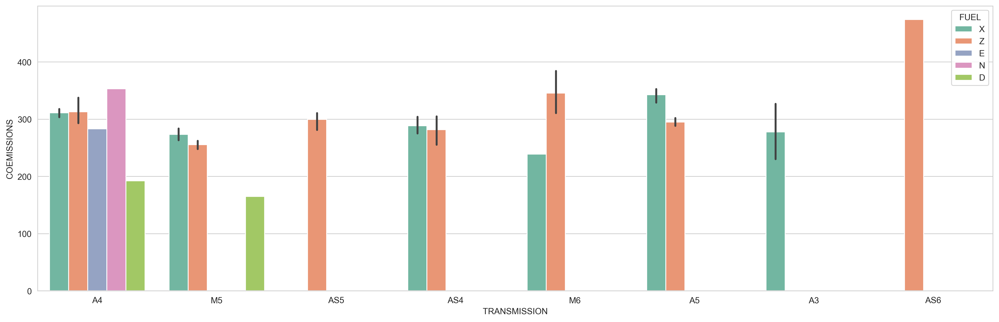

---

### Categorical Counts

Regular gasoline (`X`) dominates with 452 out of 634 records. Automatic 4-speed (`A4`) is the most common transmission type, with 321 records.

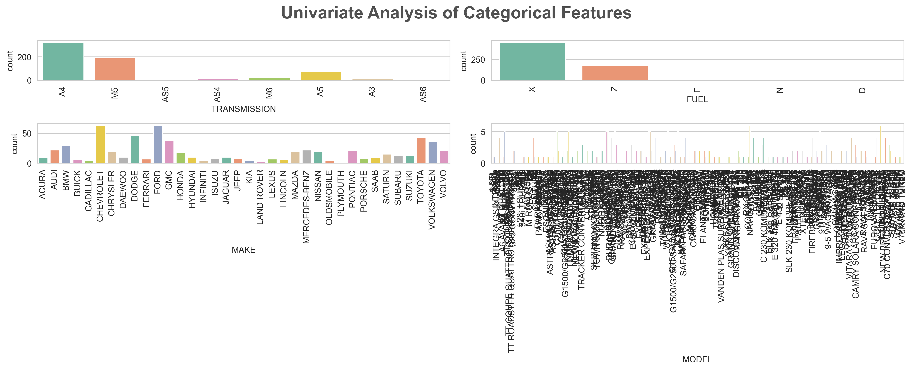

---

### Make Frequency Distribution

Chevrolet, Ford, and Toyota are the three most represented manufacturers in the dataset, collectively accounting for a significant share of all records.

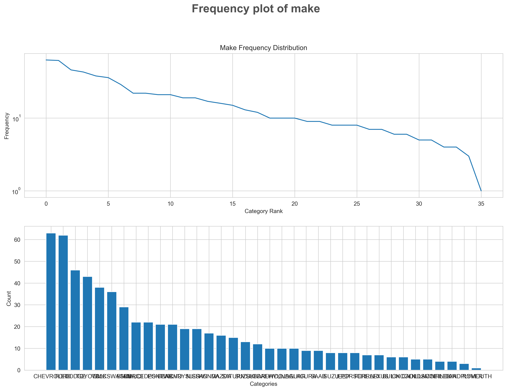

---

### Make Frequency vs Mean CO₂

High-frequency brands (Chevrolet, Ford) tend to span a wide emission range, reflecting diversified portfolios. Low-frequency luxury brands cluster at higher mean emissions.

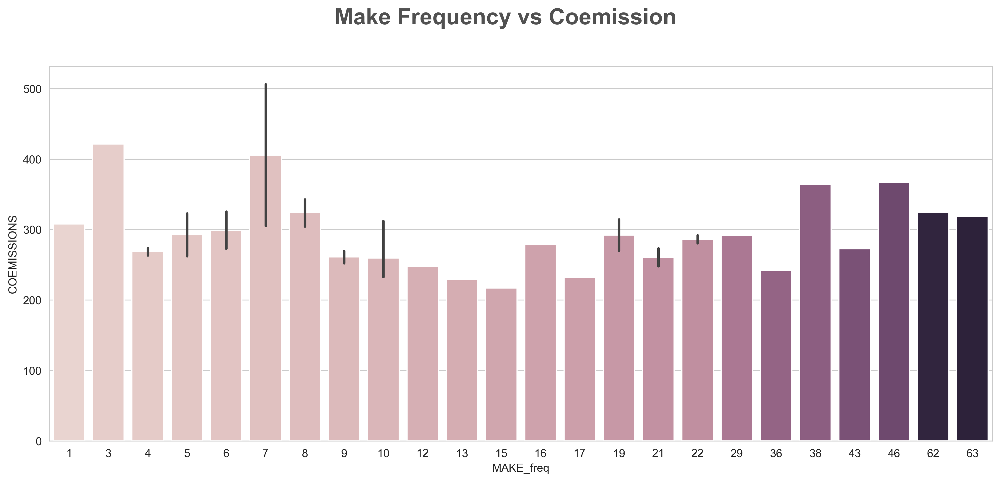

---

### Top 20 Most Frequent Models

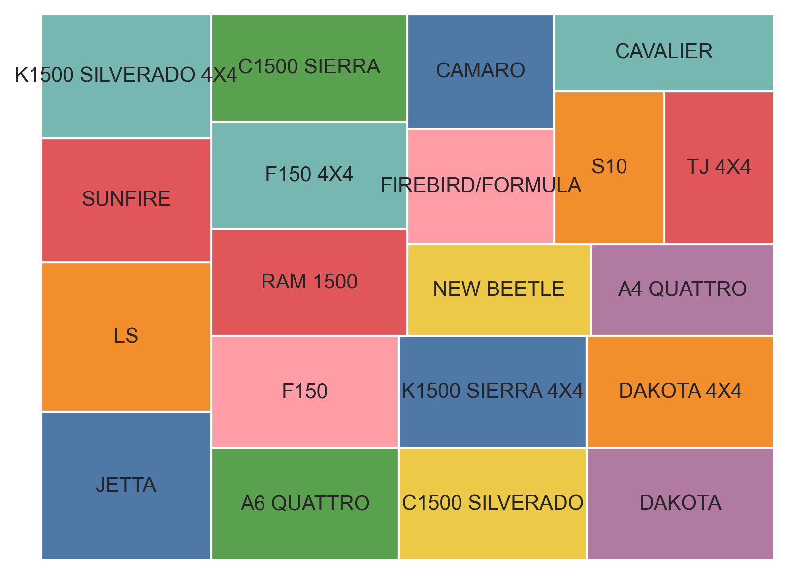

---

### Model Frequency vs Mean CO₂

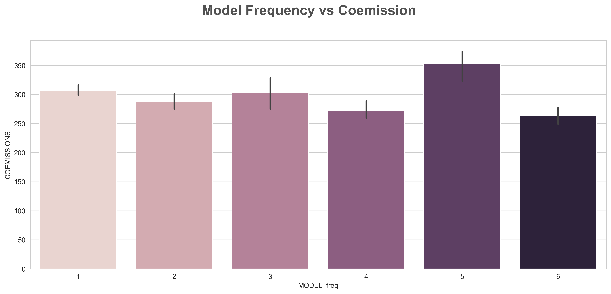

---

### Model Frequency Distribution

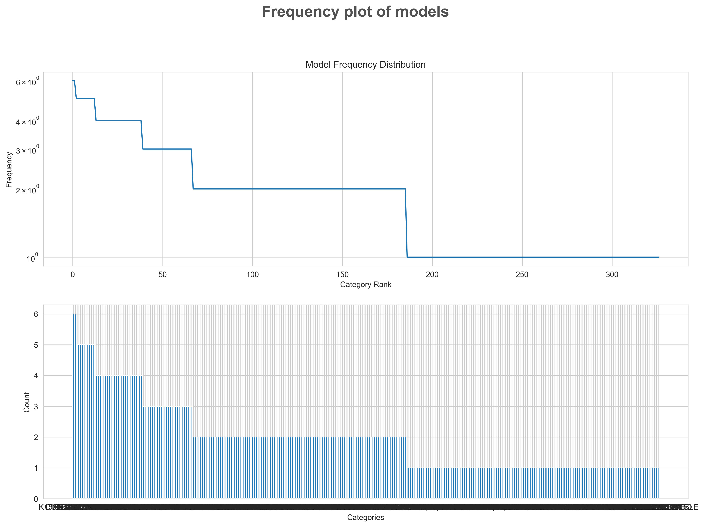

---

## ⚙️ Feature Engineering

### Mean Target Encoding

Since `MAKE`, `MODEL`, `TRANSMISSION`, and `FUEL` are categorical with many levels, standard one-hot encoding would create prohibitively sparse matrices. Instead, each category is encoded by its **mean FUEL CONSUMPTION** on the training set — a domain-justified proxy, since EDA confirmed near-perfect linear correlation between fuel consumption and CO₂.

```
Category → Mean Fuel Consumption of that category (training set only)
Unseen categories → Global training mean (stored in global_mean.yaml)
```

All encoding dictionaries are serialized to YAML under `config/column_config/` to prevent **data leakage at inference time**.

### Preprocessing Pipeline

```
Input Features
    │
    ├── Numerical: ENGINE SIZE, CYLINDERS, FUEL CONSUMPTION
    │       └── PowerTransformer → RobustScaler
    │
    └── Categorical: MAKE, MODEL, TRANSMISSION, FUEL
            └── Mean Fuel Consumption Encoding → RobustScaler
                    │
                    └── ElasticNet Regressor
```

---

## 📈 Model Training & Performance

### Algorithm: ElasticNet Regression

ElasticNet was selected as it combines L1 (Lasso) and L2 (Ridge) regularization, which:
- Handles multicollinearity between correlated features (e.g., engine size ↔ cylinders)
- Performs implicit feature selection via L1 sparsity
- Remains interpretable and deployable as a lightweight artifact

### Hyperparameter Tuning

5-fold cross-validated GridSearchCV over a log-space grid of `alpha` and `l1_ratio`.

**Best Parameters:**

| Parameter    | Value  |
|--------------|--------|
| `alpha`      | 0.0001 |
| `l1_ratio`   | 0.9    |

A high `l1_ratio` (closer to 1.0) indicates the model strongly favours Lasso-like sparsity, effectively selecting only the most predictive features.

---

### Final Model Performance (Test Set)

| Metric       | Value     |
|--------------|-----------|
| **R² Score** | **0.929100**|
| RMSE         | 18.242207|
| MAE          | 12.104134 |
| MSE          | 332.778127    |

> The model explains **~93%** of the variance in CO₂ emissions on unseen data, with a typical error of only ~10 g/km against a target range of 104–582 g/km — less than **7% of the full range**.

---

## 🔬 Model Diagnostics

All three core regression assumptions were validated post-training:

### Assumption 1 — Actual vs Predicted (Linearity)

A tight linear cloud along the diagonal confirms the model captures the true relationship without systematic bias.

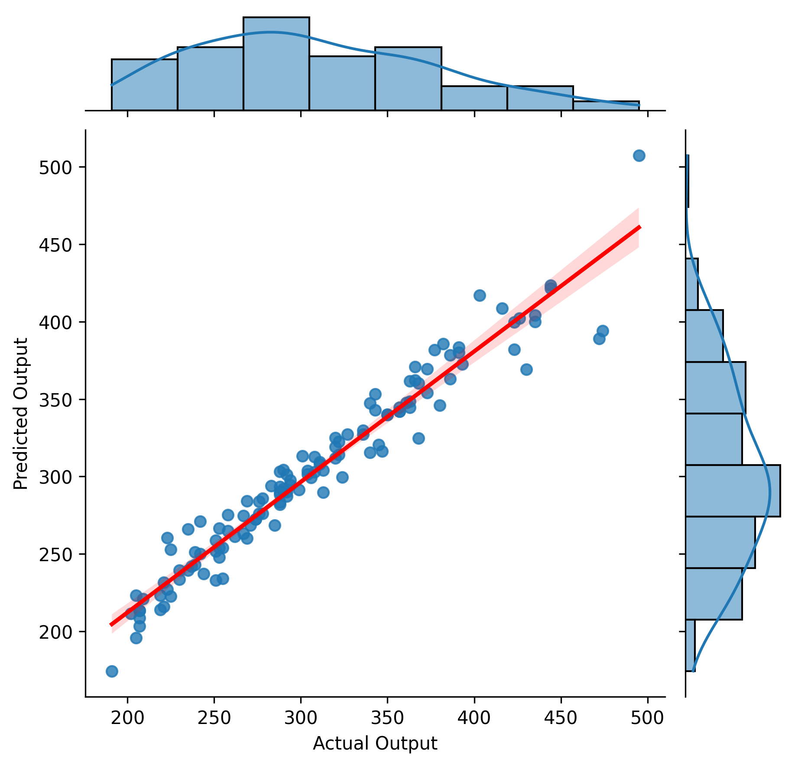

---

### Assumption 2 — Residual Distribution (Normality)

The residual distribution closely follows a normal curve, validating that errors are randomly distributed with no structural pattern.

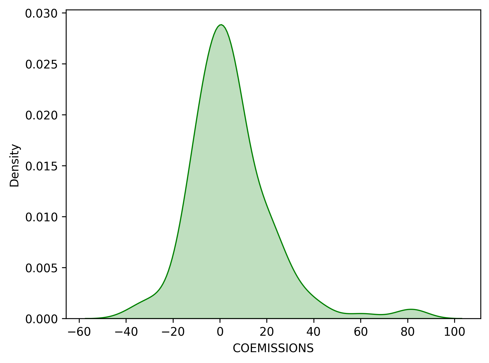

---

### Assumption 3 — Predicted vs Residuals (Homoscedasticity)

Residuals are uniformly scattered across all predicted values with no funnel shape, confirming constant error variance (homoscedasticity).

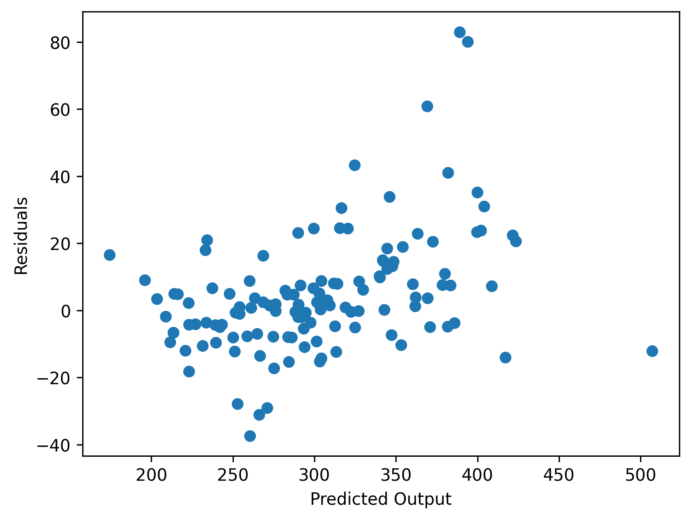

---

## 💡 Key Insights

1. **Fuel Consumption is the dominant predictor.** The near-perfect linear relationship (OLS R² = 0.998) with CO₂ makes it the single most informative feature. This is physically expected — CO₂ is a direct combustion byproduct.

2. **Engine size and cylinders are correlated secondary predictors.** Both increase emissions, but their marginal contribution diminishes once fuel consumption is included.

3. **Manual transmissions produce lower emissions on average.** This aligns with known mechanical efficiency advantages — manual gearboxes have lower parasitic losses.

4. **Fuel type creates distinct emission clusters.** Ethanol and Diesel vehicles sit outside the standard gasoline distribution, requiring the model to account for fuel-type interactions.

5. **Mean encoding outperforms one-hot for high-cardinality categoricals.** With 328 unique model names, one-hot encoding would have created sparse, uninformative features. The domain-aware encoding (mean fuel consumption per category) compresses this into a single meaningful continuous signal.

6. **ElasticNet with high L1 ratio is the right regularizer here.** The feature set contains correlated predictors (engine size ↔ cylinders) — ElasticNet's L1 component handles sparsity while L2 stabilizes correlated groups.

7. **The model generalizes robustly.** An R² of 0.9786 on the test set vs. training performance confirms minimal overfitting.

---

## 🖥️ Streamlit App

An interactive prediction dashboard built with Streamlit. Users select a vehicle make, model, transmission type, fuel type, engine size, cylinder count, and fuel consumption — and receive an instant CO₂ emission estimate.

```
app/
├── app.py        # UI — cascading sidebar selectors + prediction display
└── backend.py    # Loads model.pkl + encoding configs, runs inference
```

**Run locally:**

```bash
cd app
streamlit run app.py
```

---

## 🚀 How to Run

### 1. Clone the repository

```bash
git clone https://github.com/<your-username>/vehicle-CO-emission-forecasting.git
cd vehicle-CO-emission-forecasting
```

### 2. Install dependencies

```bash
pip install -r requirements.txt
```

### 3. Explore the Notebooks

```bash
jupyter notebook Notebooks/
```

| Notebook | Content |
|----------|---------|
| `01_EDA.ipynb` | Full exploratory analysis with visualizations |
| `02_Feature_engineering_and_model_training.ipynb` | Encoding, pipeline, GridSearchCV, diagnostics |
| `03_model_intuition.ipynb` | Model interpretability and intuition building |

### 4. Launch the Streamlit App

```bash
cd app
streamlit run app.py
```

---

## App Preview
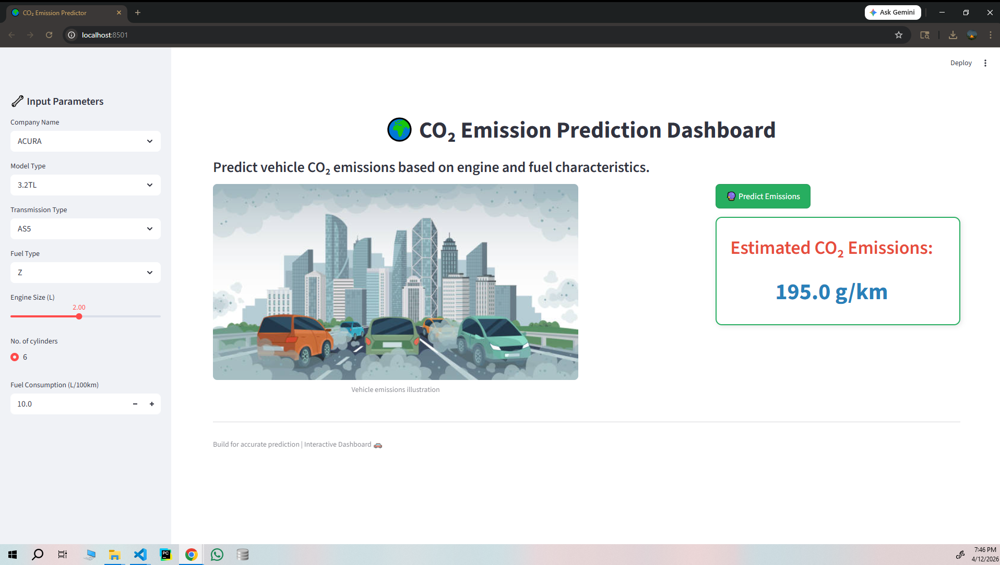

---

## 🛠️ Tech Stack

| Category         | Tools                                              |
|------------------|----------------------------------------------------|
| Language         | Python 3.10+                                       |
| Data Wrangling   | pandas, numpy, openpyxl                            |
| Visualization    | matplotlib, seaborn, plotly                        |
| ML               | scikit-learn, category_encoders, statsmodels       |
| App              | Streamlit                                          |
| Serialization    | joblib (model.pkl), PyYAML (encoding configs)      |
| Notebooks        | Jupyter                                            |

---

## 📄 License

This project is licensed under the MIT License. See [LICENSE](LICENSE) for details.

---

<p align="center">
  Built with 🌱 to understand the environmental impact of vehicle design choices.
</p>
